<div align="center">

# 🛍️ Mall Shopper Segmentation

### Unsupervised Learning for Customer Profiling & Retail Analytics

**Red & White Skill Education | Practical Exam — Unsupervised Learning (Set B)**

**Student: Misari Dhorajiya**

<br>


<br><br>


</div>

---

# 📌 Project Overview

<table>
<tr>

<td width="55%">


</td>

<td width="45%">

### 🛍️ What is this project?

This project performs **Mall Shopper Profiling using Unsupervised Learning**.

The goal is to discover natural groups of customers based on their:

- Age
- Annual Income
- Spending Score
- Gender

Three clustering algorithms are explored:

**K-Means • Agglomerative • DBSCAN**

The resulting clusters are converted into meaningful **retail shopper personas** that can support targeted marketing, loyalty programs, store planning and customer experience strategies.

</td>

</tr>
</table>

### 🛍️ What is this project?

This project performs **Mall Shopper Profiling using Unsupervised Learning**.

The goal is to discover natural groups of customers based on their:

- Age
- Annual Income
- Spending Score
- Gender

Three clustering algorithms are explored:

**K-Means • Agglomerative • DBSCAN**

The resulting clusters are converted into meaningful **retail shopper personas** that can support targeted marketing, loyalty programs, store planning and customer experience strategies.

</td>

</tr>
</table>

---

# 🎯 Business Problem

<table>
<tr>

<td width="50%">

### The Retail Challenge

A large shopping mall receives customers with very different income levels, ages and spending behaviours.

Treating every customer in the same way can result in less targeted marketing and inefficient promotional strategies.

This project uses clustering to automatically discover groups of similar shoppers.

</td>

<td width="50%">

### 💡 Business Goal

The segmentation can help retail operations teams:

- Identify customer segments
- Understand spending behaviour
- Plan targeted promotions
- Improve loyalty rewards
- Support store-placement decisions
- Design personalised customer experiences

</td>

</tr>
</table>

---

# 📊 Dataset

### Mall Customer Segmentation Data

**Source:** Kaggle — Mall Customer Segmentation

**Dataset:** 200 customers with demographic and spending information.

### Dataset Details

| Property | Value |
|---|---|
| Rows | 200 |
| Original Columns | 5 |
| Main Clustering Features | Annual Income, Spending Score |
| Additional Features | Age, Gender |
| Problem Type | Unsupervised Learning |
| Main Task | Customer Segmentation |

### Original Columns

```text
CustomerID
Genre
Age
Annual Income (k$)
Spending Score (1-100)
```

### Renamed Columns

| Original Column | Project Column |
|---|---|
| Genre | Gender |
| Annual Income (k$) | AnnualIncome |
| Spending Score (1-100) | SpendingScore |

---

# 🔎 Exploratory Data Analysis

The first stage of the project focuses on understanding the dataset before applying clustering algorithms.

The analysis includes:

- Dataset shape
- Dataset information
- First 10 records
- Missing-value analysis
- Gender distribution
- Numerical distributions
- Boxplots
- Bivariate relationships
- Correlation analysis
- Gender-wise comparison

---

## 📈 Distribution Analysis

<table>
<tr>

<td width="50%">

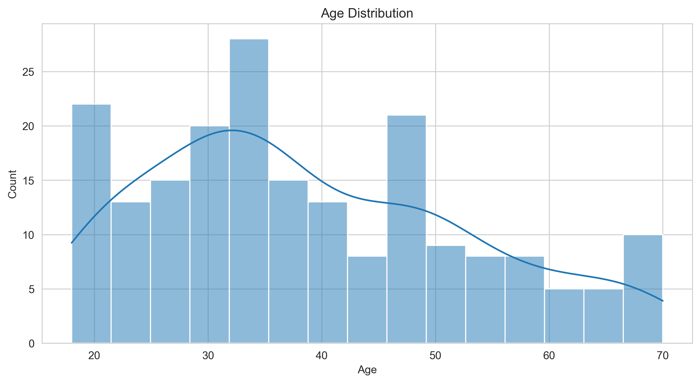

**Age Distribution**

Shows how customers are distributed across different age groups.

</td>

<td width="50%">

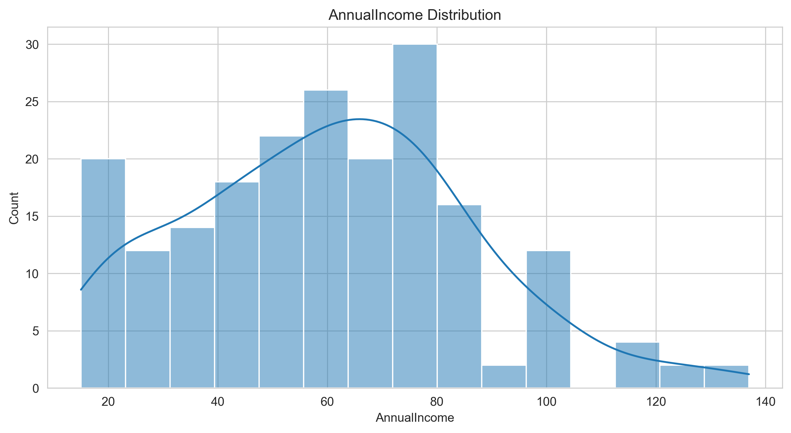

**Annual Income Distribution**

Shows the distribution of customer annual income.

</td>

</tr>

<tr>

<td width="50%">

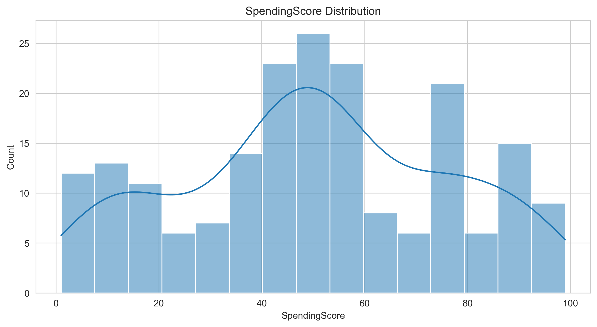

**Spending Score Distribution**

Shows how customer spending behaviour varies across the dataset.

</td>

<td width="50%">

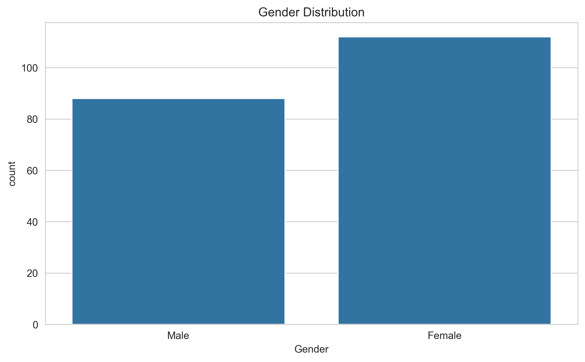

**Gender Distribution**

Provides a visual comparison of customer gender counts.

</td>

</tr>

</table>

---

# 📦 Outlier Analysis

Boxplots were used to visually inspect the numerical variables for unusual observations.

<table>
<tr>

<td width="33%">

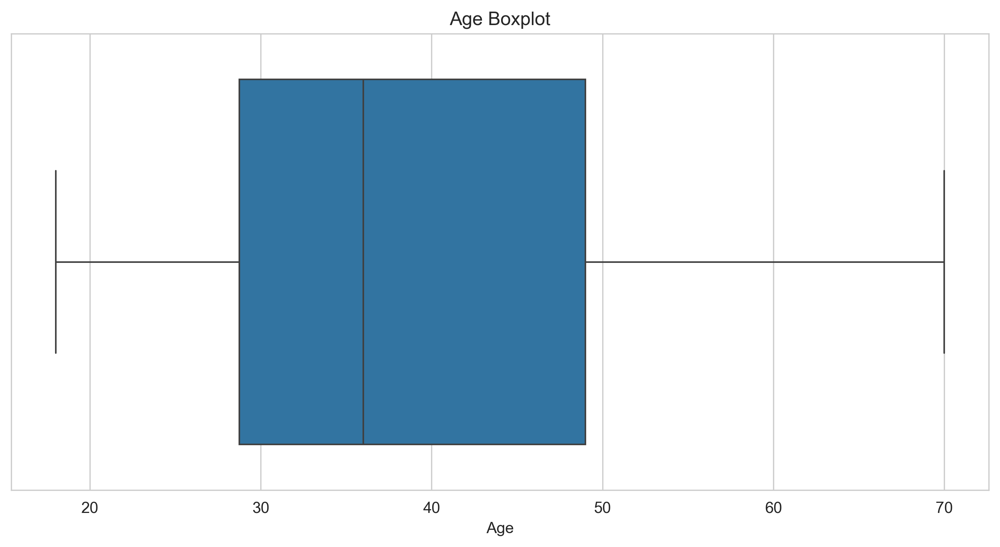

**Age**

</td>

<td width="33%">

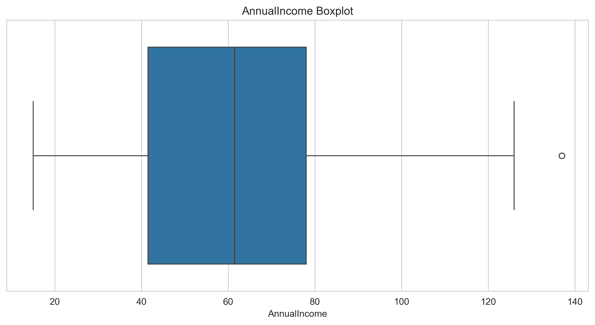

**Annual Income**

</td>

<td width="33%">

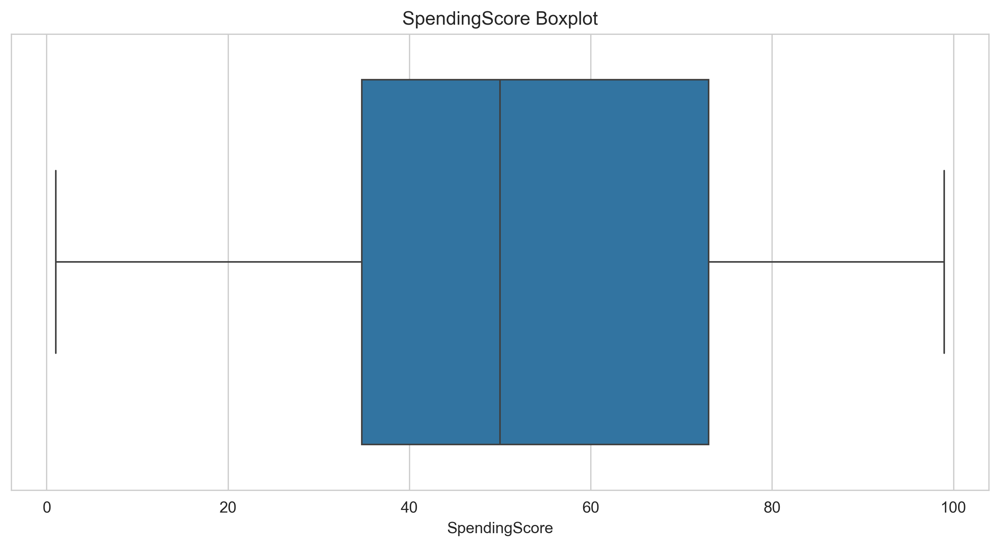

**Spending Score**

</td>

</tr>
</table>

---

# 🔥 Core Business Insight

<table>
<tr>

<td width="60%">

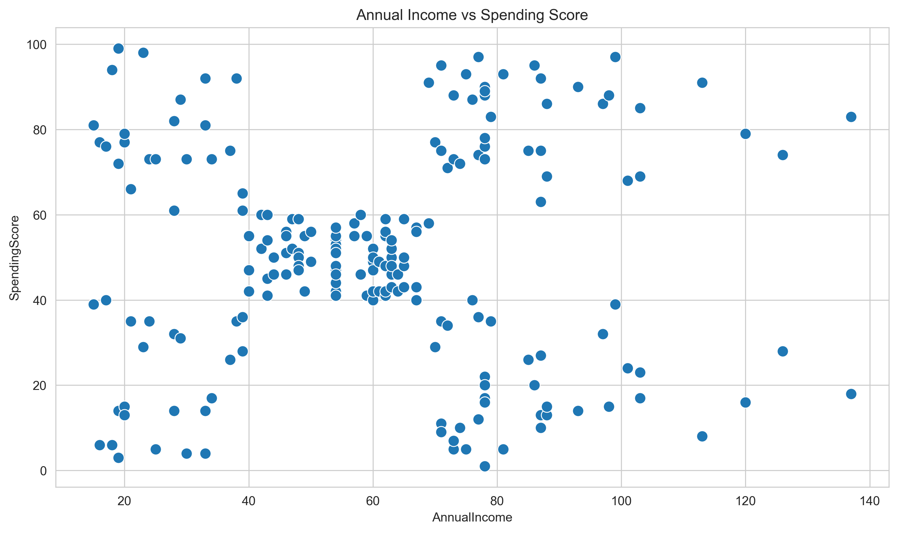

</td>

<td width="40%">

### Annual Income vs Spending Score

This is the main clustering canvas of the project.

The scatter plot shows natural groupings of customers based on:

**Income → Purchasing Power**

**Spending Score → Spending Behaviour**

These visible patterns provide the motivation for applying clustering algorithms.

</td>

</tr>
</table>

---

# 👥 Demographic Analysis

<table>
<tr>

<td width="50%">

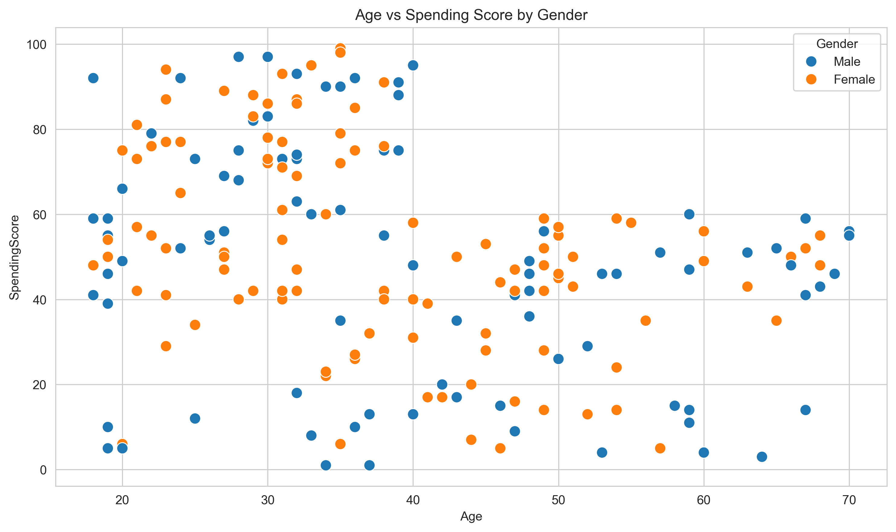

**Age vs Spending Score**

</td>

<td width="50%">

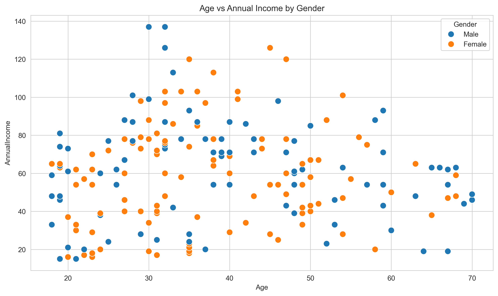

**Age vs Annual Income**

</td>

</tr>
</table>

---

# 🔗 Correlation Analysis

<table>
<tr>

<td width="55%">

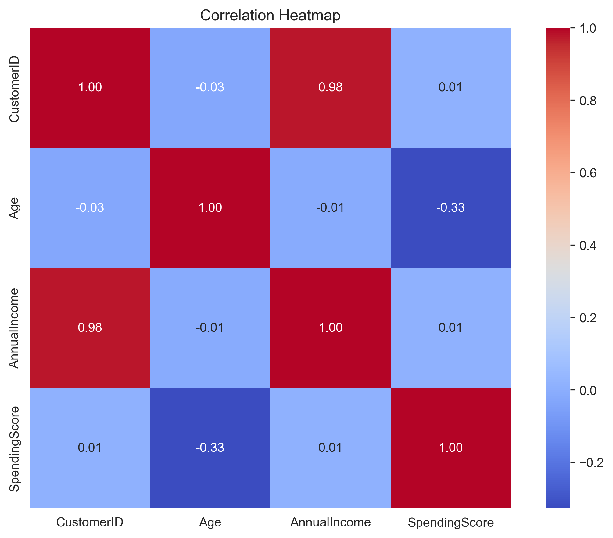

</td>

<td width="45%">

### Correlation Matrix

A numerical correlation matrix and heatmap were created to understand relationships between the numerical variables.

This analysis helps identify how strongly the numerical attributes are related before clustering.

</td>

</tr>
</table>

---

# ⚙️ Feature Engineering

Several meaningful features were engineered before clustering.

## Gender Encoding

```text
Female → 0
Male   → 1
```

The original `Gender` column is retained for visualisation and interpretation.

## Income Groups

Annual income is divided into:

```text
Low
Medium
High
```

using quantile-based binning.

## Age Groups

```text
Young       → 18–25
Adult       → 26–40
Middle-Aged → 41–55
Senior      → 55+
```

## Spending Categories

```text
Low     → 1–33
Medium  → 34–66
High    → 67–100
```

---

# 🧮 Clustering Feature Sets

Two feature representations were explored.

## 🔵 2D Feature Set

```text
AnnualIncome
SpendingScore
```

The 2D representation is useful because the customer groups can be directly visualised and interpreted.

## 🟣 Multivariate Feature Set

```text
Age
AnnualIncome
SpendingScore
Gender_enc
```

StandardScaler is applied before distance-based clustering.

> The practical exam refers to this as the multivariate/5D analysis, while the implemented feature list contains these four listed variables.

---

# 🔵 K-Means Clustering

K-Means clustering was evaluated using:

- Elbow Method
- Silhouette Score
- Cluster visualisation
- Centroid analysis
- Multivariate PCA

## Elbow Method

<table>
<tr>

<td width="60%">

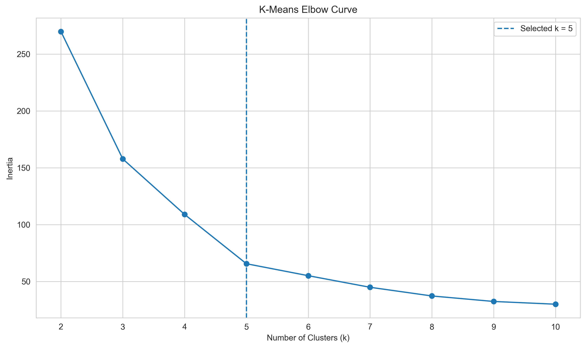

</td>

<td width="40%">

### Selecting K

The Elbow Method evaluates different values of `k` by comparing clustering inertia.

The final K-Means solution uses:

# `k = 5`

The result is also supported by the Silhouette analysis and the visible customer groupings.

</td>

</tr>
</table>

---

## K-Means Customer Clusters

<table>
<tr>

<td width="60%">

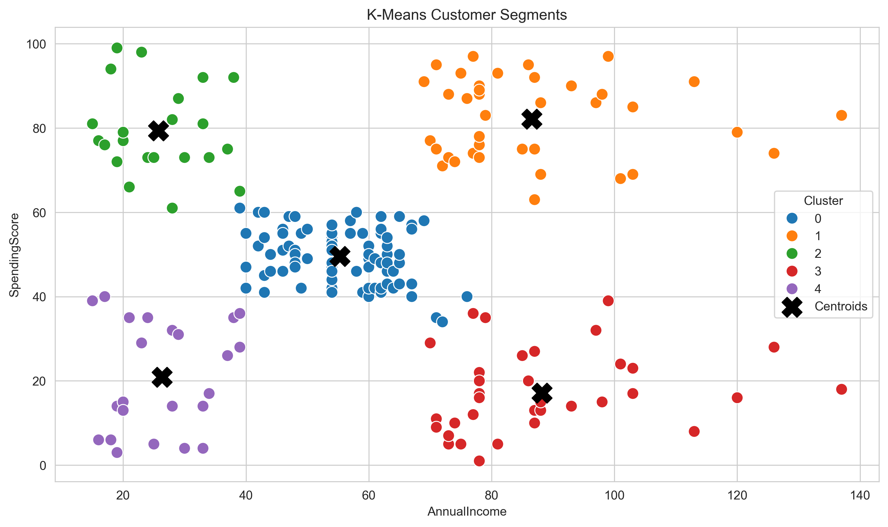

</td>

<td width="40%">

### Cluster Interpretation

The 2D K-Means model separates customers according to annual income and spending behaviour.

The cluster centroids represent the average location of each shopper segment.

</td>

</tr>
</table>

---

## Age vs Spending — K-Means

<table>
<tr>

<td width="55%">

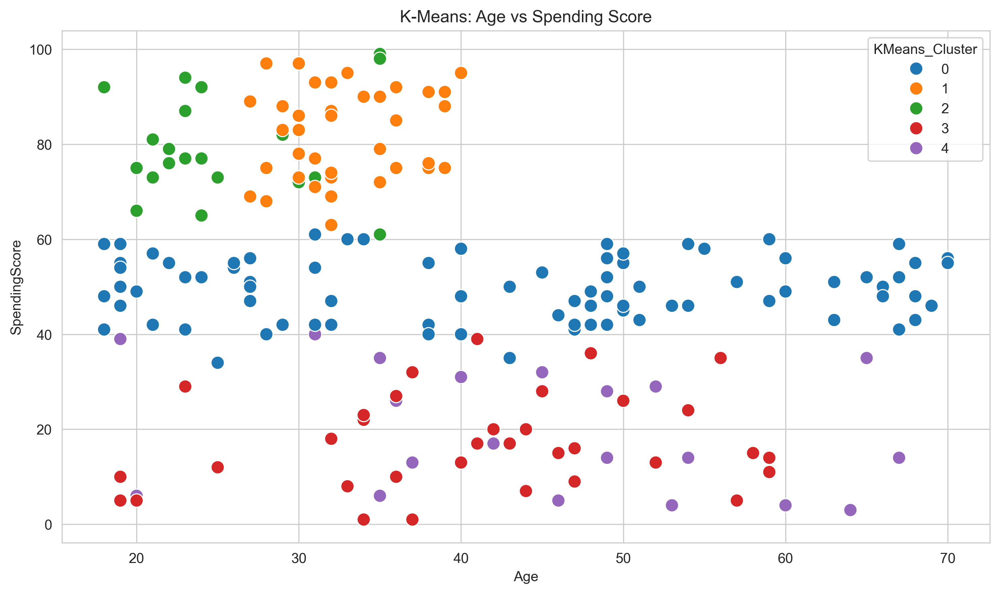

</td>

<td width="45%">

The Age vs Spending visualization helps understand whether the income-spending clusters also show demographic differences.

</td>

</tr>
</table>

---

## Multivariate K-Means — PCA

<table>
<tr>

<td width="60%">

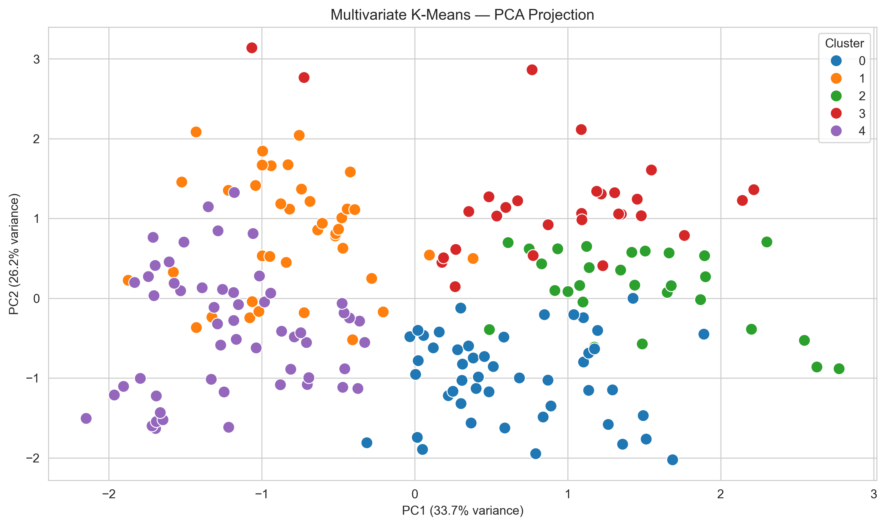

</td>

<td width="40%">

### PCA Projection

The multivariate feature space is reduced to two principal components for visualisation.

This provides another view of the separation between customer groups.

</td>

</tr>
</table>

---

# 🌳 Agglomerative Hierarchical Clustering

Hierarchical clustering was explored using:

- Ward linkage
- Complete linkage
- Average linkage
- Dendrogram analysis
- Silhouette comparison

---

## Dendrogram Analysis

<table>
<tr>

<td width="50%">

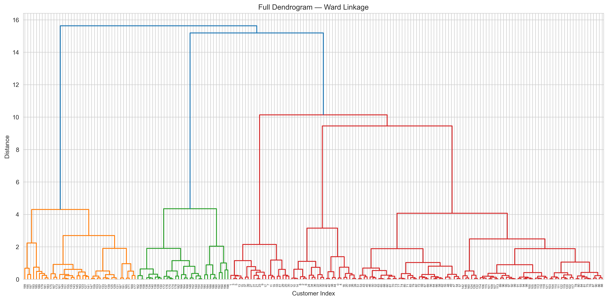

**Full Dendrogram**

</td>

<td width="50%">

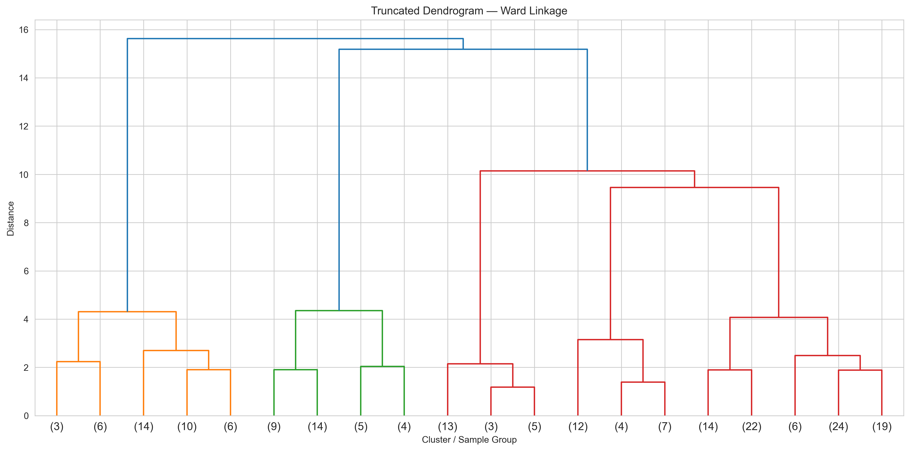

**Truncated Dendrogram**

</td>

</tr>
</table>

---

## Selected Cluster Cut

<table>
<tr>

<td width="60%">

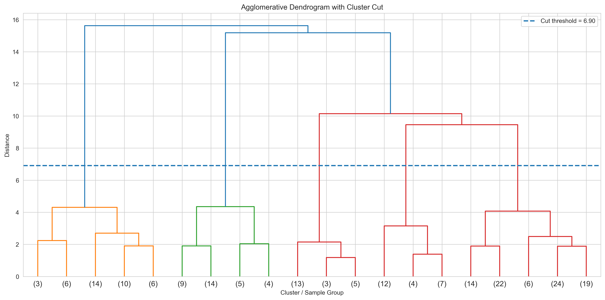

</td>

<td width="40%">

The dendrogram helps identify a meaningful separation in the hierarchical structure.

The final hierarchical clustering solution uses **5 clusters**.

</td>

</tr>
</table>

---

## Agglomerative Cluster Visualisation

<table>
<tr>

<td width="50%">


**Income vs Spending**

</td>

<td width="50%">


**Age vs Spending**

</td>

</tr>
</table>

---

# 🔴 DBSCAN Clustering

DBSCAN was used to identify density-based customer groups and possible noise points.

The tuning process included:

- k-NN distance analysis
- Epsilon selection
- `min_samples` tuning
- Parameter grid search
- Silhouette evaluation
- Noise analysis

---

## k-NN Distance Analysis

<table>
<tr>

<td width="60%">


</td>

<td width="40%">

### Epsilon Selection

The k-nearest-neighbour distance curve was used to support the selection of the DBSCAN `eps` parameter.

</td>

</tr>
</table>

---

## DBSCAN Parameter Tuning

<table>
<tr>

<td width="60%">


</td>

<td width="40%">

Different combinations of:

```text
eps
min_samples
```

were evaluated.

The best valid configuration was selected using clustering quality metrics while considering the percentage of noise points.

</td>

</tr>
</table>

---

## DBSCAN Clusters

<table>
<tr>

<td width="50%">


**Income vs Spending**

</td>

<td width="50%">


**Age vs Spending**

</td>

</tr>
</table>

---

# 📊 Multi-Metric Model Comparison

Three internal clustering metrics were used.

| Metric | Better Direction |
|---|---|
| Silhouette Score | Higher |
| Davies-Bouldin Index | Lower |
| Calinski-Harabasz Index | Higher |
| Noise % | Important for DBSCAN |

### Final Results

| Algorithm | Clusters | Silhouette | Davies-Bouldin | Calinski-Harabasz | Noise % |
|---|---:|---:|---:|---:|---:|
| K-Means | 5 | 0.5547 | 0.5722 | 248.6493 | 0.0% |
| Agglomerative | 5 | 0.5530 | 0.5779 | 244.4103 | 0.0% |
| DBSCAN | 4 | **0.5972** | **0.4734** | **263.6118** | 25.5% |

### Metric Interpretation

DBSCAN produced the strongest internal metric values:

- Highest Silhouette Score: **0.5972**
- Lowest Davies-Bouldin Index: **0.4734**
- Highest Calinski-Harabasz Index: **263.6118**

However, **25.5% of the customers were classified as noise**, which is an important business consideration.

K-Means produced a more complete segmentation with all customers assigned to a cluster.

---

# 📈 K-Means Stability

K-Means was re-run using:

```text
random_state = 0
random_state = 7
random_state = 21
random_state = 42
random_state = 99
```

### Stability Result

```text
Mean Silhouette Score = 0.5547
Standard Deviation    = 0.0000
```

The zero standard deviation indicates that the K-Means result was highly consistent across the tested random seeds on this dataset.

---

# 👥 Shopper Personas

The final K-Means cluster profiles produced five interpretable shopper personas.

---

## 🟣 1. Big Spenders

| Metric | Average |
|---|---:|
| Customers | 39 |
| Age | 32.69 |
| Annual Income | 86.54k |
| Spending Score | 82.13 |

High-income customers with high spending behaviour.

### 💼 Retail Strategy

Premium products, exclusive loyalty benefits, curated shopping experiences and high-value promotional campaigns can be considered.

---

## 🟢 2. Young Aspirers

| Metric | Average |
|---|---:|
| Customers | 22 |
| Age | 25.27 |
| Annual Income | 25.73k |
| Spending Score | 79.36 |

Younger customers with relatively lower income but high spending activity.

### 💼 Retail Strategy

Digital campaigns, fashion-focused promotions, affordable premium products and app-based offers can be used to engage this group.

---

## 🔵 3. Balanced Shoppers

| Metric | Average |
|---|---:|
| Customers | 81 |
| Age | 42.72 |
| Annual Income | 55.30k |
| Spending Score | 49.52 |

The largest segment, showing moderate income and moderate spending behaviour.

### 💼 Retail Strategy

General loyalty rewards, cross-category offers, seasonal promotions and personalised recommendations can be used.

---

## 🟠 4. Budget Shoppers

| Metric | Average |
|---|---:|
| Customers | 23 |
| Age | 45.22 |
| Annual Income | 26.30k |
| Spending Score | 20.91 |

Customers with relatively lower income and lower spending behaviour.

### 💼 Retail Strategy

Discount campaigns, value-for-money products, bundle offers and budget-focused promotions may be relevant.

---

## 🔴 5. High-Income Careful Shoppers

| Metric | Average |
|---|---:|
| Customers | 35 |
| Age | 41.11 |
| Annual Income | 88.20k |
| Spending Score | 17.11 |

Customers with high income but comparatively low spending behaviour.

### 💼 Retail Strategy

Personalised premium offers, exclusive experiences and targeted engagement campaigns can be used to understand and encourage their spending behaviour.

---

# 💼 Business Applications

The segmentation can support real-world retail decisions such as:

### 🎯 Targeted Marketing

Create different campaigns for high-value, budget-conscious and young shoppers.

### 🎁 Personalised Loyalty Rewards

Provide rewards according to customer spending behaviour.

### 🏬 Store Placement

Use customer segment information to understand which store categories may be positioned near specific customer traffic zones.

### 🎪 Promotional Events

Design segment-specific events and campaigns.

### 📱 Mall App Personalisation

Use shopper personas to provide personalised recommendations and offers.

---

# 🧪 New Shopper Prediction

The project includes a reusable:

```python
classify_shopper()
```

function.

It accepts new shopper information such as:

```text
Age
AnnualIncome
SpendingScore
Gender
```

and returns:

```text
Cluster Label
Retail Persona
```

The pipeline is tested on five hypothetical shoppers.

---

# 💾 Saved Machine Learning Pipeline

The project saves the reusable model components using `joblib`.

### `mall_scaler.pkl`

Stores the scaler used during preprocessing.

### `mall_segmentation_model.pkl`

Stores the selected final clustering model.

These files allow the trained segmentation pipeline to be reused without rebuilding the complete clustering process.

---

# 📂 Project Structure

```text
mall-shopper-segmentation-unsupervised-learning/
│
├── MallShopperSegmentation_UnsupervisedLearning.ipynb
├── Mall_Customers.csv
├── mall_scaler.pkl
├── mall_segmentation_model.pkl
├── summary_report.md
├── requirements.txt
├── README.md
│
└── images/
    ├── mall-shopper-hero.jpg
    ├── EDA visualisations
    ├── K-Means visualisations
    ├── Agglomerative visualisations
    └── DBSCAN visualisations
```

---

# 🚀 Installation & Setup

## 1. Clone Repository

```bash
git clone https://github.com/dhorajiyamisri/mall-shopper-segmentation-unsupervised-learning.git
```

## 2. Open Project Folder

```bash
cd mall-shopper-segmentation-unsupervised-learning
```

## 3. Install Dependencies

```bash
pip install -r requirements.txt
```

## 4. Launch Jupyter Notebook

```bash
jupyter notebook
```

Open:

```text
MallShopperSegmentation_UnsupervisedLearning.ipynb
```

Run the notebook from top to bottom.

---

# 📦 Required Libraries

```text
pandas
numpy
matplotlib
seaborn
scikit-learn
scipy
plotly
joblib
```

---

# 📄 Project Documentation

### Summary Report

A detailed project summary is available in:

```text
summary_report.md
```

The report covers:

- Business problem
- Dataset
- Feature selection
- Algorithm comparison
- Shopper personas
- Future improvements

---

# 🎥 Practical Exam Video

### Face + Screen Recording

**Video Link:**

```text
[PASTE GOOGLE DRIVE / YOUTUBE UNLISTED LINK HERE]
```

The recorded demonstration covers:

- Project objective
- Dataset and EDA
- Feature engineering
- K-Means
- Agglomerative clustering
- DBSCAN
- Evaluation metrics
- Shopper personas
- Business interpretation

**Duration:** 5–10 minutes

---

# 🔮 Future Improvements

Future versions of this project can include additional behavioural data such as:

- Purchase categories
- Transaction value
- Visit frequency
- Preferred stores
- Loyalty-program behaviour
- Footfall sensor data
- Online/offline shopping behaviour

Possible future machine learning extensions include:

- Semi-supervised learning
- Real-time customer segmentation
- Persona tagging API
- Mall mobile-app integration
- Personalised recommendation systems

---

# 🎓 Practical Exam Information

<div align="center">

### Red & White Skill Education

**Practical Exam — Unsupervised Learning (Set B)**

**Mall Shopper Profiling**

> *Quality is our Motto.*

</div>

---

# 👨‍💻 Author

<div align="center">

## Misari Dhorajiyа

### AI & ML with Data Science

Red & White Skill Education

**Unsupervised Learning • Machine Learning • Data Analytics**

</div>

---

# ⭐ Project Highlights

```text
✓ Exploratory Data Analysis
✓ Feature Engineering
✓ StandardScaler Preprocessing
✓ K-Means Clustering
✓ Elbow Method
✓ Silhouette Analysis
✓ Agglomerative Hierarchical Clustering
✓ Dendrogram Analysis
✓ DBSCAN
✓ k-NN Distance Analysis
✓ Multi-Metric Evaluation
✓ K-Means Stability Testing
✓ Retail Shopper Personas
✓ Business Recommendations
✓ Model & Scaler Saving
✓ Reusable Shopper Classification
✓ GitHub-Ready Project
```

---

<div align="center">

### 🛍️ Turning Customer Data into Retail Insights

**Mall Shopper Segmentation using Unsupervised Learning**

</div>
